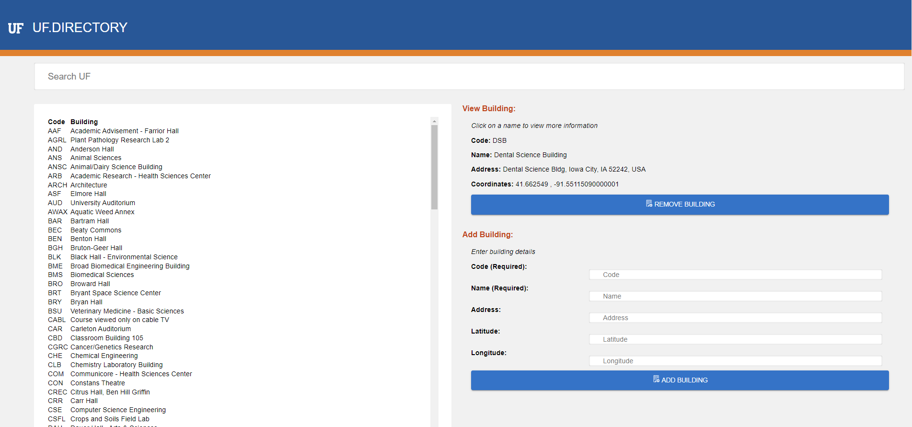

The UF Directory App is a dynamic web application designed to showcase over 100 buildings in Gainesville using a university database.

It contains features like:
- Information collection of over 100+ buildings on or near UF Campus
- Search and Filter Buildings based on name, addres, etc
- Ability to add additional buildings
- Ability to delete buildings

Below you can find what the application looks like. 

To start the application, simply clone the repository and run "npm run dev" in the my-app folder. 
